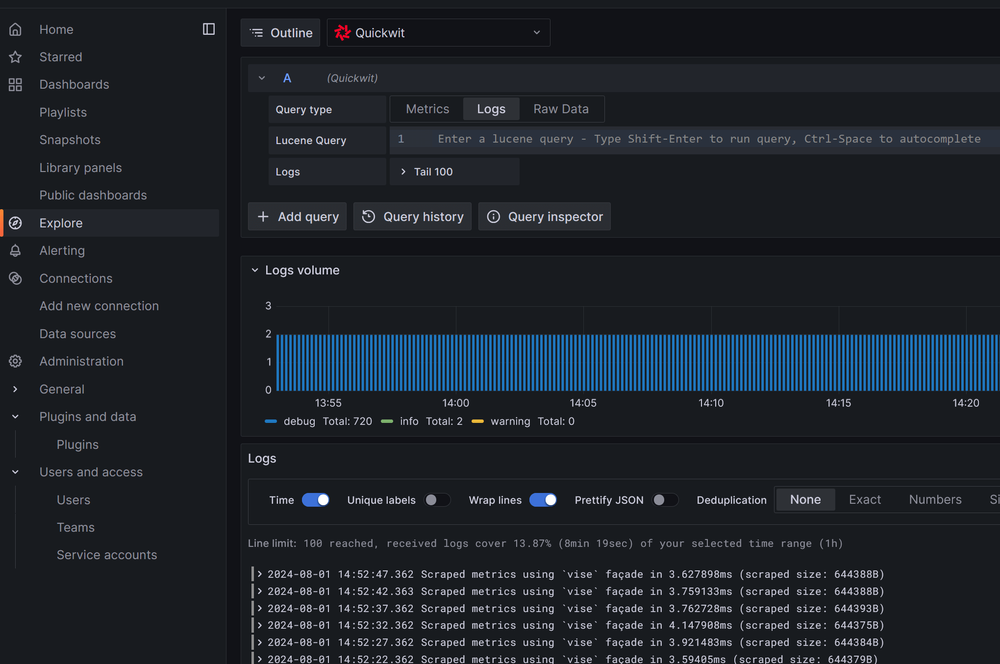

# Era Observability

This repository contains JSON sources for Grafana dashboards that are used to observe ZKsync Era as well as can be
used for any other ZK Stack chains / External Node deployment. The dashboards are updated automatically.

## How to use

This repository contains a Docker compose setup that is prepared to work with a local ZKsync deployment.
All the ports are pre-configured to match the default port layout of local ZKsync configuration.

The configuration is capable of collecting Prometheus metrics, Opentelemetry traces, and Opentelemetry logs.

The setup can be launched via:

```
docker compose up -d
```

The grafana will be available at [http://localhost:3000](http://localhost:3000).

Alternatively the dashboards can be imported as-is via the Grafana JSON importer.

> Note: some panels might be empty, depending on whether you are running a full Hyperchain or External Node.

## Infrastructure overview

The docker compose configures the following services:

- Prometheus. Configured to scrape data from all the main ZKsync components. [Configuration](./etc/prometheus/prometheus.yml).
- Pushgateway. Not used by default, and not recommended to use, but still configured. May be useful when working with one-shot jobs
  locally.
- Quickwit. Collects logs and traces. Works with default configuration.
- Opentelemetry-collector. A "proxy" for collecting OTLP logs from ZKsync components before sending them to Quickwit.
  See [configuration](./etc/opentelemetry-collector/config.yaml) for more details on why is it needed.
- Jaeger-query. Acts as a Grafana datasource for traces, but also has the UI on [http://localhost:16686/](http://localhost:16686/).
- Grafana. Configured with Prometheus (metrics), Jaeger (traces), and Quickwit (logs) datasources, and automatically loads
  dashboards located in the [dashboards](./dashboards/) folder. [Configuration](./etc/grafana/).
- Caddy. Acts as a reverse proxy for all the components. [Configuration](./etc/caddy/Caddyfile).

## ZKsync node setup

With default configuration, ZKsync node would run the Prometheus exporter, but won't export logs or traces.
For the exact steps to configure OTLP, refer to the ZKsync documentation, but with the env-based configs, you need to supply the following
variables:

```bash
OPENTELEMETRY_LEVEL=info
OTLP_ENDPOINT=http://127.0.0.1:7280/api/v1/otlp/v1/traces
OTLP_LOGS_ENDPOINT=http://127.0.0.1:4318/v1/logs
```

Additionally, you may expose information about the running binary. This is optional; if not provided, default values will be used:

```bash
POD_NAME=server-0
POD_NAMESPACE=local
SERVICE_NAME=zksync-server
```

Important: as of Aug 2024, Opentelemetry exporter is not configured for the external node. This will be fixed in the future, but meanwhile
external nodes can only export metrics.

## Accessing information

This section covers accessing different kinds of information in grafana using local setup.

### Grafana dashboards

There are several pre-configured dashboards by default. Most likely, it makes sense to reduce time range from 24h to 15m to check if it works.
Additional sample dashboards are available in the `additional_dashboards` directory. To use one just add it to the `dashboard` directory.

Any changes you do locally will also be saved locally. However, they are only persisted within the docker-compose volume.

### Traces

To access tracing information, open the "Explore" tab, and choose the "Jaeger" data source.

Choose the service of interest, and operation name (corresponds to the span name provided either via `tracing::instrument` or manually created
span in the code).

You will see all the recorded traces within the chosen time period. All of them are clickable, and click opens the detailed trace view. Each
span within the trace is clickable too, and may have attributes (e.g. `l1_batch` and events (logs)).

If you configured `SERVICE_NAME`/`POD_NAME`/`POD_NAMESPACE` variables, you'll see them in the span attributes, and you can filter spans
based on these attributes.


### Logs

To access logs, open the "Explore" tab, and choose the "Quickwit" data source.

See the [Quickwit query language](https://quickwit.io/docs/reference/query-language) for more details.



## Acknowledgments

The `docker-compose` setup and configuration in this repository are based on the awesome [dockprom](https://github.com/stefanprodan/dockprom),
which is licensed under [MIT License](https://github.com/stefanprodan/dockprom/blob/master/LICENSE).

## Dashboards

- **General** - one pager high level overview of L1/L2 blockchains and L2 APIs;
- **Sequencer** - detailed sequencer-related metrics.
- **Prover** - metrics for prover infrastructure

## License

This repository is licensed under MIT license. See [LICENSE](./LICENSE) for more details.
